# wazuh-exercise-6

## Estructura del repositorio

El repositorio se compone de tres directorios principales.
- ./.github/workflows permite definir los `workflows` de GitHub Action que es el sistema de `CI/CD` que vamos a usar para resolver el ejericio por está integrado en la plataforma de GitHub, ser gratuito para la capa de uso que tenemos, y porque es lo que uso en mi TFG.
- ./iac. Contiene la definición de las plantillas de AWS Cloudformation que definen la arquitectura cloud que propongo para resolver el ejercicio.
- ./src. Contiene la configuración de los servicios de wazuh, así como la definición de la composición de servicios (solución basada en contenedores).
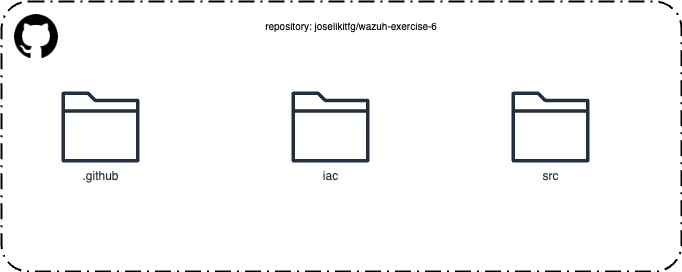


## Infrastructura necesaria (infra/deploy_cf.yml)
Este stack de CloudFormation crea una configuración de red básica para Wazuh con dos subredes públicas. A continuación se detallan los recursos creados por este stack y su configuración.

1. **VPC (Virtual Private Cloud)**:
   - CIDR: `10.0.0.0/27`
   - Habilita soporte para DNS y nombres de host.

2. **Internet Gateway**:
   - Proporciona acceso a internet para la VPC.

3. **Subredes Públicas**:
   - **Subred Pública 1**:
     - CIDR: `10.0.0.0/28`
     - Zona de disponibilidad: `eu-west-1a`
   - **Subred Pública 2**:
     - CIDR: `10.0.0.16/28`
     - Zona de disponibilidad: `eu-west-1b`

4. **Tabla de Rutas**:
   - Tabla de rutas pública asociada con ambas subredes públicas.
   - Ruta predeterminada (`0.0.0.0/0`) hacia el Internet Gateway.

5. **KeyPair**:
   - KeyPair generado dinámicamente para acceder a las instancias EC2.

6. **Role**:
   - **Nombre**: InstanceRole
   - **Descripción**: Rol IAM para la instancia EC2 con permisos de acceso a Amazon S3 y administración de instancias SSM.
   - **Políticas gestionadas**:
     - `AmazonSSMManagedInstanceCore`
     - `AmazonS3FullAccess`

7. **Instancias**:
   - **Security Group**: Permite acceso SSH (`puerto 22`) desde cualquier IP.
   - **Instancia EC2**:
     - Tipo de instancia: `t2.medium`
     - AMI: `ami-00138b07206d4ceaf`
     - KeyPair: Utiliza el KeyPair generado.
     - Se despliega en la Subred Pública 1.

8. **S3 Bucket**:
   - **Nombre**: wazuh-ex-6-bucket
   - **Descripción**: Bucket S3 con control de acceso privado y versioning habilitado.
   - **Propiedades adicionales**: 
   - Control de acceso: `Private`
   - Versioning: `Enabled`

9. **SecurityGroup**: 
   - **Descripción**: Grupo de seguridad con las siguientes reglas de ingreso.
   - Puertos 1514, 1515, 514, 55000, 9200, y 443 abiertos para tráfico TCP desde cualquier origen (`0.0.0.0/0`).

### Despliegue de la infra necesaria

Se puede hacer manual con:

```bash
aws cloudformation create-stack --stack-name Exercise6 --template-body file://infra/cf_template.yml --region eu-west-1 --capabilities CAPABILITY_NAMED_IAM
```

O con la pipeline de GitHub Action

> [!NOTE]  
> Asegúrate de que el KeyPair generado esté almacenado de manera segura, ya que se utilizará para acceder a las instancias EC2.
> Este stack está configurado para desplegarse en la región eu-west-1. Si deseas utilizar otra región, modifica el comando de despliegue en consecuencia.

> [!NOTE]  
> Este stack está configurado para desplegarse en la región eu-west-1. Si deseas utilizar otra región, modifica el comando de despliegue en consecuencia.


#### Resultado de desplegar la infra en AWS

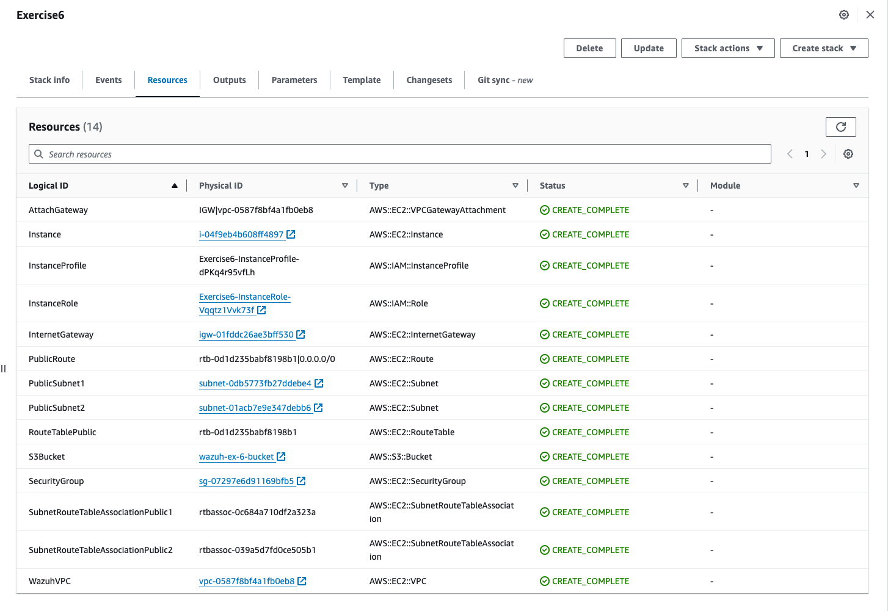
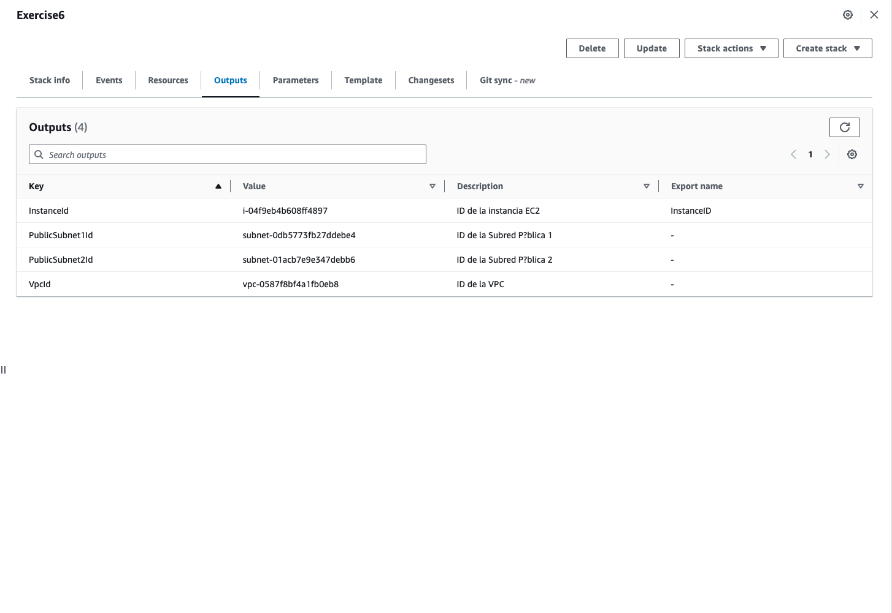


## Wazuh Docker Deployment (src)

Contiene la definición del fichero de composición de servicios de wazuh (`docker-compose.yml`) y el conjunto de configuraciones de forma declarativa de cada uno de los servicios.

La lista de ficheros de configuración que se sincronizan desde el repositorio de github (fuente de verdad) es:

- ./src/docker-compose.yml -> Este archivo define los servicios, redes y volúmenes necesarios para desplegar la pila de Wazuh en Docker. Incluye configuraciones para los contenedores de Wazuh, wazuh-indexer y wazuh-dashboard, entre otros.
- ./src/config/wazuh_cluster/wazuh_manager.conf -> Archivo de configuración para el clúster de Wazuh Manager. Define parámetros como la dirección del servidor, opciones de clusterización, y configuraciones específicas del gestor de Wazuh. 
- ./src/config/wazuh_dashboard/opensearch_dashboards.yml -> Configuración para OpenSearch Dashboards (wazuh-dashboard realmente). Incluye ajustes de conexión a wazuh-indexer, autenticación, y otros parámetros de visualización y seguridad.
- ./src/config/wazuh_dashboard/wazuh.yml -> Configuración específica para la integración de Wazuh con wazuh-dashboard.
- ./src/config/wazuh_indexer/internal_users.yml ->  Define usuarios internos para el wazuh-indexer. Contiene las credenciales y roles de los usuarios que tienen acceso al sistema.
- ./src/config/wazuh_indexer/wazuh.indexer.yml -> Archivo de configuración para el wazuh-indexer. Incluye ajustes relacionados con el rendimiento, seguridad, y manejo de índices.
- ./src/config/certs.yml -> Contiene configuraciones relacionadas con los certificados de seguridad utilizados en las conexiones seguras entre los distintos componentes de Wazuh y wazuh-indexer.

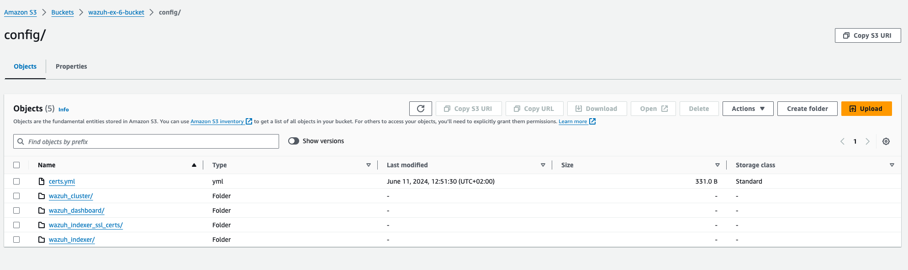

Cabe notar que falta el directorio `wazuh_indexer_ssl_certs/` que contiene los certificados de cada uno de los servicios. Esto ha sido generado manualmente y anteriormente usando `docker-compose -f generate-indexer-certs.yml run --rm generator` y se encuentran en el bucket de s3 generado. Se descargan en la instancia cada vez que se ejecuta la action `cicd.yml`.

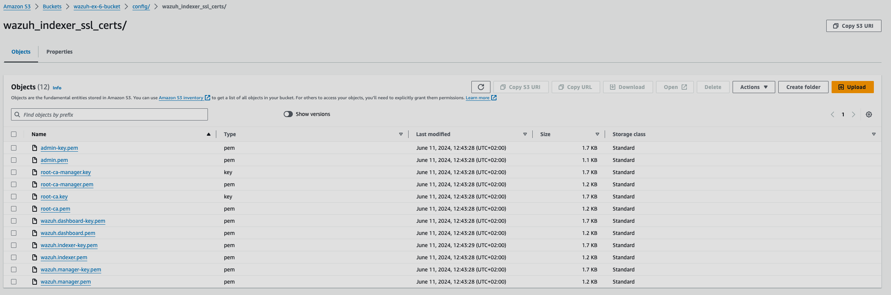


## GitHub Action Workflows. CI/CD

> [!NOTE]  
> Para la autenticación de GitHub Action con la cuenta de AWS, se ha usado la implementación de un rol OIDC en lugar de las credenciales de un usuario programático, dando más robustez y seguridad al proceso, aprovechando el setup de mi Trabajo de Fin de Grado.

Se han usado dos pipelines diferentes para desplegar tanto la infraestructura necesaria como para aplicar la configuración de cada uno de los componentes de wazuh (en contenedores) tomando el repositorio de GitHub como fuente de verdad siempre.
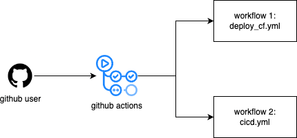


Aquí se pueden ver todas las ejecuciones de los workflows
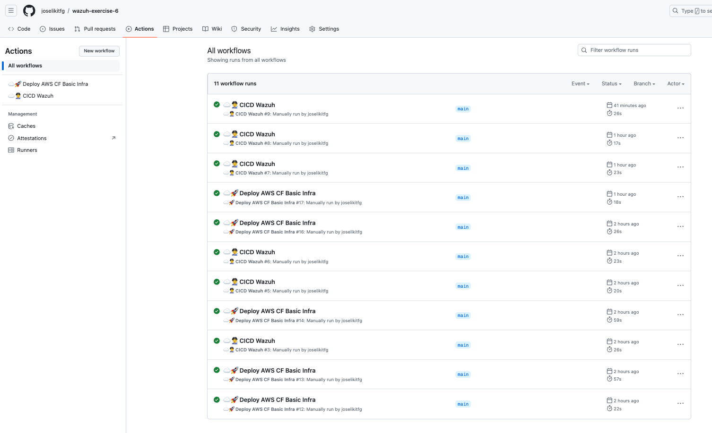


Aquí se puede ver un ejemplo de ejecución del workflow `deploy_cf` que mantiene alineada la definición como código de la infraestructura con los elementos existentes realmente en AWS.
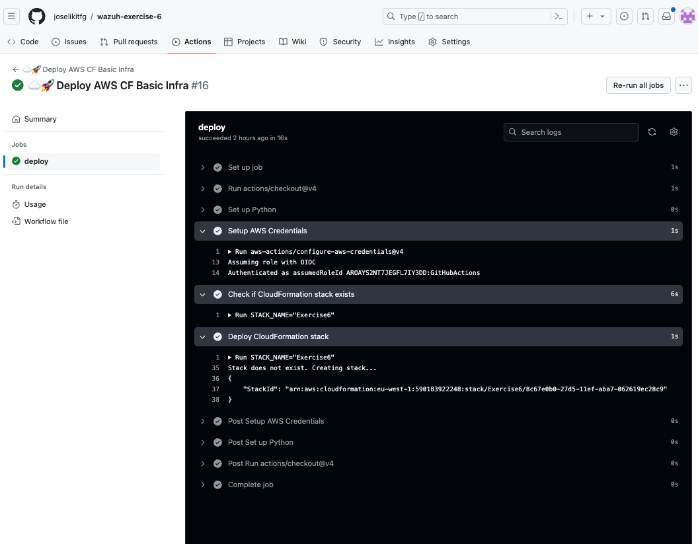


Aquí se puede ver un ejemplo de ejecución del workflow `cicd`.
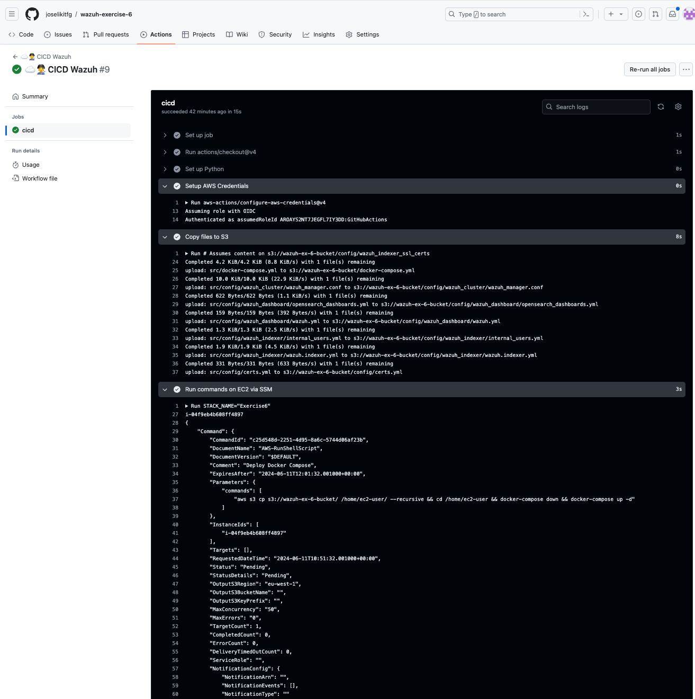


Aquí se puede observar el histórico de comandos de SSM Commands que ejecuta el workflow de `cicd` hasta conseguir el resultado.
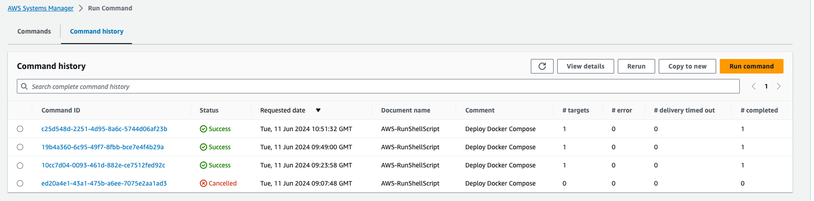

Aprovechamos la IP de la instancia para acceder y comprobar el estado del servicio
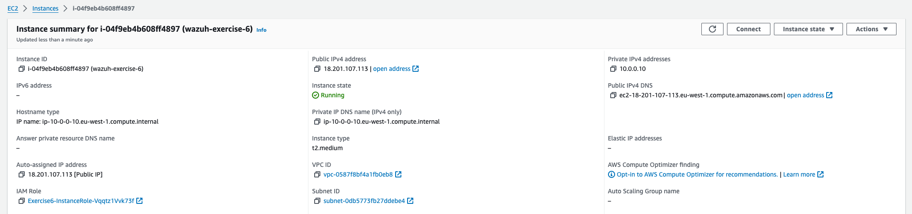


Finalmente podemos ver el servicio de Wazuh desplegado y funcionando tomando el repositorio como fuente de verdad y las GitHub Action como sistema de CI/CD.
